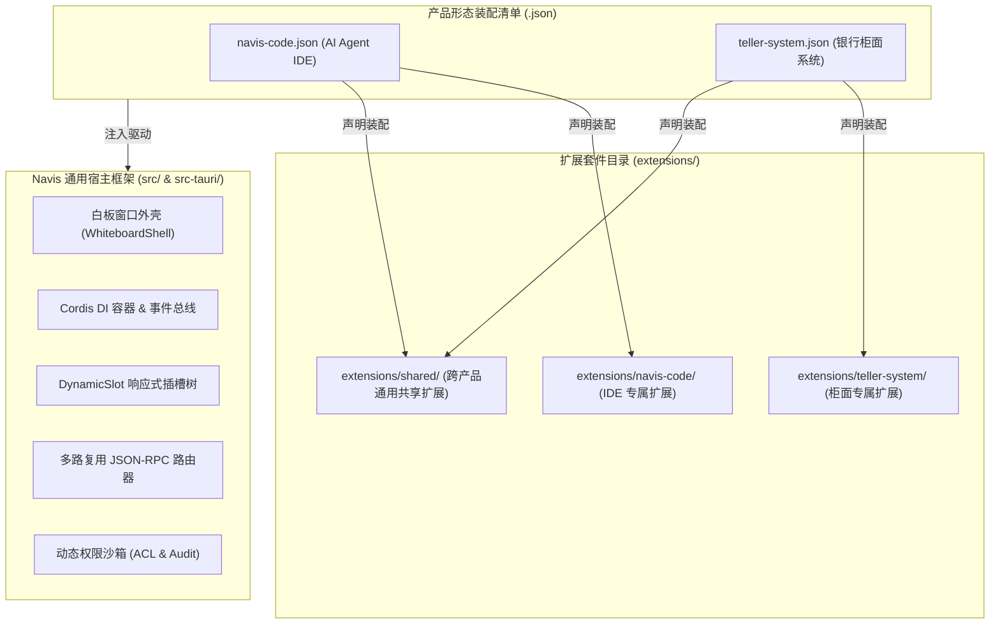
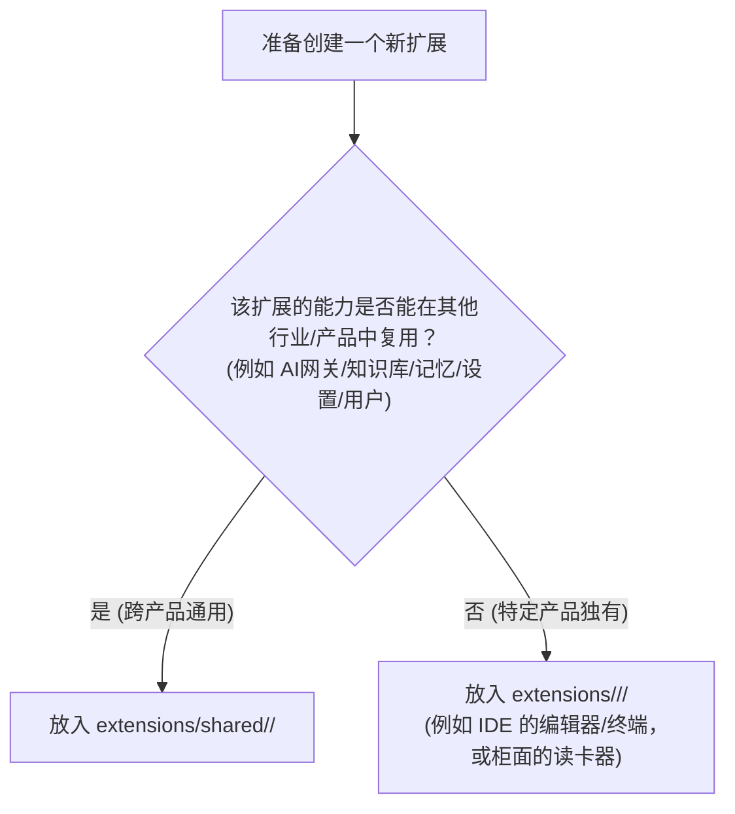

# 36 — 扩展开发权威指南（Extension Development Guide）

> **最新更新**：2026-08-21  
> **适用范围**：Navis 通用桌面应用白板与扩展运行时底座  
> **核心原则**：**万物皆扩展（Everything is an Extension）· 宿主纯净 · 高内聚低耦合**

---

## 目录索引

1. [架构定位与设计哲学](#一架构定位与设计哲学)
2. [多产品形态开发与装配（Product Assembly）](#二多产品形态开发与装配product-assembly)
3. [扩展物理目录与套件分组规范（Suites & Shared Pool）](#三扩展物理目录与套件分组规范suites--shared-pool)
4. [扩展清单规范（`extension.json` 泛型协议）](#四扩展清单规范extensionjson-泛型协议)
5. [UI 扩展开发与嵌套挂载（Slot-in-Slot 递归插槽）](#五ui-扩展开发与嵌套挂载slot-in-slot-递归插槽)
6. [跨产品公共部件复用策略（Shared Components）](#六跨产品公共部件复用策略shared-components)
7. [二级贡献点分发中心（Secondary Contribution Points）](#七二级贡献点分发中心secondary-contribution-points)
8. [全链路通信与 Cordis DI 机制](#八全链路通信与-cordis-di-机制)
9. [后端扩展开发（stdio JSON-RPC 多语言支持）](#九后端扩展开发stdio-json-rpc-多语言支持)
10. [安全沙箱与动态 ACL 权限控制](#十安全沙箱与动态-acl-权限控制)
11. [5 分钟从零开发扩展实战教程](#十一5-分钟从零开发扩展实战教程)

---

## 一、架构定位与设计哲学

Navis 通用底座（`src/` 与 `src-tauri/`）是一个**纯净的桌面应用白板宿主与扩展运行时**，灵感源自 Cordis 扩展体系。

### 1.1 框架与业务的严格物理隔离

- **通用框架层（白板宿主）**：只负责窗口生命周期、扩展递归扫描/加载/启停、Cordis IoC 容器（DI）、事件总线（emit/waterfall/serial/parallel）、响应式插槽树（DynamicSlot）、安全沙箱 ACL、多路复用 IPC 路由器与流式通道。
- **业务扩展层（业务领域）**：AI 网关、Agent 执行流、会话管理、项目文件树、代码编辑器、Diff 视图、终端 PTY、知识库、长期记忆、任务看板、设置面板，以及银行柜面系统、双录系统等所有垂直业务，**全部作为独立扩展实现**。
- **产品形态（产品清单）**：产品形态不是硬编码的单一软件，而是由根目录 `<product>.json` 声明装配的一组扩展套件。



---

## 二、多产品形态开发与装配（Product Assembly）

在 Navis 上开发一个全新的产品（如银行柜面系统 `teller-system`、双录系统 `double-record`），**绝对不需要修改 Navis 底座的任何一行源码**。

### 2.1 创建产品清单文件

在仓库根目录新建 `<product-id>.json`（例如 `teller-system.json`）：

```json
{
  "id": "teller-system",
  "name": "银行智能柜面系统",
  "shell": "teller-shell",
  "description": "基于 Navis 白板构建的银行网点柜面综合业务客户端",
  "extensions": [
    "teller-shell",
    "teller-id-reader",
    "teller-biz-flow",
    "navis-ai-platform",
    "navis-knowledge",
    "navis-memory",
    "navis-settings"
  ]
}
```

### 2.2 字段说明

| 字段 | 类型 | 说明 |
|---|---|---|
| `id` | string | 产品唯一标识符，匹配环境变量 `NAVIS_PRODUCT` |
| `name` | string | 产品展示名称 |
| `shell` | string? | 产品的主壳扩展 ID（挂载到白板根插槽 `root`） |
| `description` | string? | 产品描述 |
| `extensions` | string[] | 本产品装配激活的扩展 ID 列表（包含专属套件与共享扩展） |

### 2.3 启动与切换产品形态

- **开发期调试指定产品**：
  ```bash
  # 启动 Navis Code (默认)
  $env:NAVIS_PRODUCT="navis-code"; npm run dev
  
  # 启动 银行柜面系统
  $env:NAVIS_PRODUCT="teller-system"; npm run dev
  ```
- **生产运行期**：将 `<product-id>.json` 放置于 `<app_data>/navis/<product-id>.json`，宿主启动时自动识别加载。

---

## 三、扩展物理目录与套件分组规范（Suites & Shared Pool）

为了避免多产品并存时目录膨胀和归属不清，扩展统一采用 **“产品专属套件 + 跨产品共享池”** 体系。

### 3.1 目录组织结构

```text
extensions/
├── README.md                       # 扩展根目录说明
│
├── navis-code/                     # 【Navis Code 产品专属套件】
│   ├── navis-code/                 # Navis Code 产品壳主布局
│   ├── navis-agent-core/           # Agent 对话区 (Composer)、时间线 (Timeline) 与执行流
│   ├── navis-editor/               # 代码编辑器与 Diff 视图
│   └── navis-terminal/             # PTY 终端与 Shell 命令行
│
├── teller-system/                  # 【银行柜面产品专属套件】（示例）
│   ├── teller-shell/               # 柜面主布局与双屏外壳
│   ├── teller-id-reader/           # 身份证读卡器与外设驱动
│   └── teller-biz-flow/            # 柜面业务办理流
│
└── shared/                         # 【跨产品通用共享扩展池】（所有产品清单按需装配）
    ├── navis-ai-platform/          # 统一 AI 网关、模型管理与 ToolRegistry
    ├── navis-session/              # 会话管理与历史列表
    ├── navis-project/              # 工作区与项目目录管理
    ├── navis-knowledge/            # 业务知识库与本地 RAG 检索
    ├── navis-memory/               # 长期记忆与偏好配置
    ├── navis-settings/             # 系统与扩展参数配置弹窗
    ├── navis-task/                 # 任务看板与计划跟踪
    └── navis-demo/                 # 标准全链路示例扩展
```

### 3.2 归属决策准则（放专属还是放共享？）



### 3.3 扩展内部固定物理契约

无论扩展位于专属套件还是共享池，内部必须严格遵循统一标准：

```text
extensions/<suite>/<extension-id>/
├── extension.json                 # 扩展清单（唯一元数据与能力声明入口）
├── README.md                      # 扩展说明文档
├── ExtensionUI/                   # 全部前端代码、组件与样式
│   ├── src/
│   │   ├── index.tsx              # 前端插件入口（导出 NavisPlugin）
│   │   ├── components/            # 专属 SolidJS UI 组件
│   │   └── stores/                # 扩展自持状态
│   └── styles/                    # 专属 CSS 样式
└── ExtensionBackend/              # 全部后端扩展点代码
    ├── src/                       # 后端业务源码
    └── main.mjs (或可执行文件)     # 后端进程入口（stdio JSON-RPC）
```

---

## 四、扩展清单规范（`extension.json` 泛型协议）

`extension.json` 是扩展的逻辑身份证与能力声明清单，框架采用 **Schema-Agnostic 泛型设计**：

```json
{
  "id": "navis-demo",
  "name": "Navis Demo Extension",
  "version": "1.0.0",
  "displayName": "Navis Demo",
  "publisher": "navis",
  "description": "标准全链路扩展示例",
  "main": "./ExtensionBackend/main.mjs",
  "ui": "./ExtensionUI/src/index.tsx",
  "permissions": {
    "fs.read": true,
    "fs.write": true,
    "network": true,
    "shell.exec": true
  },
  "contributes": {
    "slots": [
      {
        "id": "navis-demo.banner",
        "target": "root",
        "component": "DemoBanner",
        "priority": 90
      }
    ],
    "providesSlots": [
      "navis-demo.actions"
    ],
    "commands": [
      { "id": "demo.ping", "title": "Demo Ping Backend" },
      { "id": "demo.stream", "title": "Demo Stream" }
    ],
    "tools": [
      {
        "name": "echo",
        "description": "Echo text back from backend",
        "parameters": {
          "type": "object",
          "properties": { "text": { "type": "string" } }
        }
      }
    ],
    "pipelineHooks": [
      { "hook": "beforeToolExecute", "handler": "toolGuard" }
    ]
  }
}
```

### 清单核心字段详解

| 字段 | 类型 | 必填 | 说明 |
|---|---|---|---|
| `id` | string | 是 | 扩展唯一 ID，产品清单装配与 RPC 寻址的逻辑标识 |
| `name` | string | 是 | 扩展名 |
| `version` | string | 是 | 语义化版本号（如 `1.0.0`） |
| `main` | string | 否 | 后端进程入口相对路径（支持 `.mjs`、`.js`、`.py` 或本机二进制） |
| `ui` | string | 否 | 前端入口源码相对路径（如 `./ExtensionUI/src/index.tsx`） |
| `permissions` | object | 否 | 声明申请的权限原语（`fs.read`, `fs.write`, `network`, `shell.exec` 等） |
| `contributes.slots` | array | 否 | 声明挂载到指定插槽的组件（延迟按名解析） |
| `contributes.providesSlots` | string[] | 否 | 声明本扩展开辟并提供给系统的新插槽命名空间 |
| `contributes.commands` | array | 否 | 声明注册的命令列表 |
| `contributes.*` | any | 否 | **自定义泛型贡献点**（如 `tools`、`pipelineHooks`、`deviceDrivers`），由对应的扩展插件监听处理 |

---

## 五、UI 扩展开发与嵌套挂载（Slot-in-Slot 递归插槽）

Navis 支持 **无限级插槽嵌套（Slot-in-Slot）**。白板宿主只提供 `root` 和 `overlay` 两个根插槽，后续所有层级均由扩展按需开辟和消费。

### 5.1 级联插槽挂载模型

```text
[Navis 白板宿主]
  └── 暴露根插槽: root
        └── 挂载 [产品壳扩展: navis-code]
              ├── 开辟子插槽: navis-code.sidebar.left
              │     ├── 挂载 [navis-session 扩展]
              │     │     └── 开辟细粒度插槽: session.item.actions
              │     │           └── 挂载 [session-backup 子插件]
              │     └── 挂载 [navis-project 扩展]
              │
              └── 开辟子插槽: navis-code.viewport.main
                    ├── 挂载 [navis-agent-core 扩展]
                    │     └── 开辟细粒度插槽: agent.composer.tools
                    │           └── 挂载 [voice-input 语音输入插件]
                    └── 挂载 [navis-editor 扩展]
```

### 5.2 开辟插槽：在组件中使用 `<DynamicSlot>`

任何扩展组件都可以在自己内部开辟插槽供更细粒度的扩展插入：

```tsx
import { DynamicSlot } from '@/core/slots/DynamicSlot';

export const StudioLayout = () => {
  return (
    <div class="studio-layout">
      {/* 顶部工具栏开辟公共插槽 */}
      <header class="studio-header">
        <DynamicSlot name="app.header.actions" fallback={<span>Default Actions</span>} />
      </header>

      {/* 左侧边栏插槽 */}
      <aside class="studio-sidebar">
        <DynamicSlot name="navis-code.sidebar.left" />
      </aside>

      {/* 主视口插槽 */}
      <main class="studio-main">
        <DynamicSlot name="navis-code.viewport.main" />
      </main>
    </div>
  );
};
```

### 5.3 消费插槽：在扩展中投影组件

扩展可以通过以下两种方式将组件挂载到插槽：

#### 方式 1：在 `extension.json` 清单中静态声明
```json
{
  "contributes": {
    "slots": [
      {
        "id": "navis-session.sidebar-view",
        "target": "navis-code.sidebar.left",
        "component": "SessionList",
        "priority": 10
      }
    ]
  }
}
```
并在 `ExtensionUI/src/index.tsx` 中绑定具名组件：
```tsx
import { componentRegistry } from '@/core/components/ComponentRegistry';
import { SessionList } from './components/SessionList';

export const SessionPlugin: NavisPlugin = {
  name: 'navis-session',
  apply: async (ctx) => {
    componentRegistry.bind('navis-session', {
      SessionList: () => <SessionList ctx={ctx} />,
    });
  },
};
```

#### 方式 2：在 `apply(ctx)` 中通过代码动态注册
```tsx
ctx.views.register('navis-code.sidebar.left', {
  id: 'navis-session.sidebar-view',
  pluginId: 'navis-session',
  priority: 10,
  component: () => <SessionList ctx={ctx} />,
});
```

### 5.4 插槽设计的正交化与命名空间规范（Orthogonal Slot Isolation）

**核心避坑原则**：严禁多个不同功能的业务扩展默认抢占同一个主视口或主侧边栏插槽。

1. **插槽责任单一性**：
   - 专属于协同会话树的插槽（如 `navis-code.sidebar.left`）仅供 `navis-session` 挂载；
   - 文件树 Explorer 必须声明挂载到 `navis-code.sidebar.explorer`；
   - Agent 主工作区（`navis-code.viewport.main`）只承载 Agent 欢迎页与 Composer；
   - 代码编辑器、任务看板、终端面板分别拥有专属插槽 `navis-code.viewport.editor`、`navis-code.viewport.task`、`navis-code.viewport.terminal`。
2. **多视图切换由产品壳调度**：
   - 产品壳（如 `StudioLayout`）通过状态（如 `activeMode: 'cowork' | 'code'`）决定当前渲染哪个主插槽，绝不能让所有业务扩展同时并列注入同一个 `<DynamicSlot>` 形成千层饼堆叠。

### 5.5 插槽注册去重与幂等性保障（Slot Deduplication & Idempotency）

在 Navis 架构中，扩展既可能在 `extension.json` 中静态声明插槽，又可能在 TypeScript `apply(ctx)` 中通过 `ctx.views.register` 或代码方式动态注入。

宿主 `SlotStore` 严格执行基于 `(id, pluginId)` 唯一键的**幂等性覆盖更新机制**：
- 当检测到同一插件已注册相同 `id` 的插槽贡献时，执行原地覆盖替换（Update），而不是简单 `push` 追加；
- 该机制有效防御了“静态清单解析 + 前端动态注册”双通道导致的**双份组件/双重欢迎屏堆叠**问题，并天然支持 Vite 前端热重载（HMR）下的安全无感刷新。

### 5.6 插槽容器 CSS Flexbox 撑满规范（Slot Container Layout Hygiene）

由于 `DynamicSlot` 是一个框架无关的渲染容器，在使用时必须遵循以下 CSS 规则：
1. **容器高度撑满**：宿主及产品壳为插槽提供的父容器，以及插槽本身的 class（如 `.navis-sidebar-slot`、`.navis-main-slot`），必须具备：
   ```css
   .navis-sidebar-slot,
   .navis-main-slot {
     width: 100%;
     height: 100%;
     display: flex;
     flex-direction: column;
     flex: 1;
     min-height: 0;
     overflow: hidden;
   }
   ```
2. **避免溢出挤压底栏**：如果子组件包含长列表（如项目会话树），必须将滚动区域显式声明为 `flex: 1; overflow-y: auto;`，同时将底部状态条（如 `super · Gateway`）声明为 `flex-shrink: 0;`，确保底部常驻工具栏永不被长列表推挤出屏幕。

---

## 六、跨产品公共部件复用策略（Shared Components）

对于“右上角关闭 X 按钮”、“全局设置入口”、“网络/硬件状态指示器”等公共组件，Navis 提供了三种跨产品共享模式：

### 模式一：桌面宿主外壳级通用部件（适用于窗口级基础设施）
- **适用场景**：无边框自定义窗口的“最小化、最大化、关闭 X 按钮”、全屏快捷键、全局崩溃边界。
- **实现位置**：直接写在通用宿主外壳 [`src/app/WhiteboardShell.tsx`](file:///D:/myworkspace/Navis%20Go/src/app/WhiteboardShell.tsx) 中。
- **效果**：所有产品形态（Navis Code、银行柜面系统等）开箱即自动拥有该能力。

### 模式二：跨产品公共插槽约定（适用于各产品顶部/状态栏公共部件）
- **约定公共插槽名**：多个产品壳在各自的顶部右侧均暴露同名插槽 `<DynamicSlot name="app.header.actions" />`。
- **共享扩展挂载**：`extensions/shared/` 中的公共扩展声明挂载到 `app.header.actions`。
- **效果**：无论激活哪个产品，公共部件都会自动渲染在对应产品的右上角。

### 模式三：全局悬浮层插槽（适用于全局弹窗、悬浮浮窗、Toast 提示）
- **挂载目标**：宿主白板内置的 `overlay` 全局插槽。
- **注册代码**：
  ```tsx
  ctx.views.register('overlay', {
    id: 'common.quick-floating-action',
    component: () => <FloatingQuickAction />,
  });
  ```

---

## 七、二级贡献点分发中心（Secondary Contribution Points）

宿主的 `ContributionRegistry` 是开放泛型的。**不仅框架层可以处理贡献点，扩展自身也可以监听并承接其他扩展声明的自定义贡献点**。

### 7.1 自定义贡献点示例：AI 工具网关

1. **业务扩展声明 tools**：
   `extensions/navis-code/navis-editor/extension.json` 声明：
   ```json
   {
     "contributes": {
       "tools": [
         { "name": "editor.saveFile", "description": "保存当前编辑器文件" }
       ]
     }
   }
   ```
2. **AI 网关扩展监听 tools 贡献**：
   `extensions/shared/navis-ai-platform/ExtensionUI/src/index.tsx` 中注册处理器：
   ```tsx
   import { contributionRegistry } from '@/core/manifest/ContributionRegistry';

   export const AiPlatformPlugin: NavisPlugin = {
     name: 'navis-ai-platform',
     apply: async (ctx) => {
       // 监听系统中所有扩展声明的 "tools"
       contributionRegistry.registerHandler('tools', (toolDefs, { pluginId }) => {
         for (const tool of toolDefs as any[]) {
           toolRegistry.registerTool(pluginId, tool);
         }
       });
     },
   };
   ```

---

## 八、全链路通信与 Cordis DI 机制

### 8.1 扩展前端通信 API 全览

每个前端扩展入口接收 `ctx: NavisContext`，具备以下能力：

```tsx
export const MyPlugin: NavisPlugin = {
  name: 'my-plugin',
  apply: async (ctx: NavisContext) => {
    // 1. IoC 服务注入与消费 (DI)
    ctx.services.provide('database', myDbInstance);
    const db = ctx.services.use<Database>('database');

    // 2. 事件发布与订阅 (Event Bus)
    const unsub = ctx.events.on('session:change', (session) => {
      console.log('Session changed:', session);
    });

    // 3. 事件流水线拦截 (Waterfall Middleware)
    ctx.events.waterfallHook('agent:prompt:before', async (prompt, next) => {
      const enrichedPrompt = `${prompt}\n[附加系统上下文]`;
      return next(enrichedPrompt);
    });

    // 4. 命令注册与触发 (Commands)
    ctx.commands.register('my-plugin:format-code', async (args) => {
      return doFormat(args);
    });
    const res = await ctx.commands.execute('my-plugin:format-code', { file: 'a.ts' });

    // 5. 视图投影 (Views)
    ctx.views.register('navis-code.sidebar.left', {
      id: 'my-panel',
      component: () => <MyPanel />,
    });
  },
};
```

### 8.2 前端调用后端通用 IPC 桥（`tauri-bridge.ts`）

```typescript
import { coreRouteIpc, coreRouteStream, navisDispatch } from '@/core/tauri-bridge';

// 1. 同步 JSON-RPC 请求
const pong = await coreRouteIpc('navis-demo', 'demo.ping', { timestamp: Date.now() });

// 2. 流式通道请求 (Server Push Stream)
await coreRouteStream('navis-demo', 'demo.stream', { query: 'hello' }, (chunk) => {
  console.log('收到流式推送片段:', chunk);
});

// 3. 统一分发 (宿主自动识别路由到 Rust 进程内或插件子进程)
await navisDispatch('navis-demo', 'demo.ping', {});
```

---

## 九、后端扩展开发（stdio JSON-RPC 多语言支持）

后端扩展点以**独立子进程**运行，支持 **Node.js、Python、Rust、Go 或原生编译二进制可执行文件**，通过标准输入输出（`stdio`）承接 JSON-RPC 2.0 协议。

### 9.1 通信协议契约

- **请求与响应（Request / Response）**：
  - 宿主通过 `stdin` 发送一行 JSON：`{"jsonrpc":"2.0","id":"req-1","method":"tool.add","params":{"a":2,"b":3}}\n`
  - 插件处理后向 `stdout` 输出一行 JSON：`{"jsonrpc":"2.0","id":"req-1","result":{"sum":5}}\n`
- **流式推送通知（Stream Notification）**：
  - 插件向 `stdout` 输出无 `id` 的通知：`{"jsonrpc":"2.0","method":"demo.stream","params":{"chunk":"data-1"}}\n`
  - 结束时返回带 `id` 的最终结果：`{"jsonrpc":"2.0","id":"req-2","result":{"status":"completed"}}\n`

### 9.2 Python 后端示例 (`ExtensionBackend/main.py`)

```python
import sys
import json

def main():
    for line in sys.stdin:
        line = line.strip()
        if not line:
            continue
        try:
            req = json.loads(line)
            req_id = req.get("id")
            method = req.get("method")
            params = req.get("params", {})

            if method == "demo.ping":
                resp = {"jsonrpc": "2.0", "id": req_id, "result": {"pong": True}}
                sys.stdout.write(json.dumps(resp) + "\n")
                sys.stdout.flush()
            elif method == "tool.add":
                result = {"sum": params.get("a", 0) + params.get("b", 0)}
                resp = {"jsonrpc": "2.0", "id": req_id, "result": result}
                sys.stdout.write(json.dumps(resp) + "\n")
                sys.stdout.flush()
        except Exception as e:
            err_resp = {"jsonrpc": "2.0", "id": req_id, "error": {"code": -32603, "message": str(e)}}
            sys.stdout.write(json.dumps(err_resp) + "\n")
            sys.stdout.flush()

if __name__ == "__main__":
    main()
```

---

## 十、安全沙箱与动态 ACL 权限控制

Navis 采用**能力原语沙箱（Capability-based Sandbox）**，杜绝扩展拥有无限特权。

### 10.1 核心能力原语

| 能力原语 | 对应权限声明 | 允许的操作范围 |
|---|---|---|
| `FsRead` | `fs.read` | 读取本地工作区与受限目录文件 |
| `FsWrite` | `fs.write` | 写入/修改本地文件 |
| `ShellExec` | `shell.exec` | 启动 Shell 子进程执行系统命令 |
| `Network` | `network` | 发起外网 HTTP/WebSocket 请求 |
| `EventEmit` | `event.emit` | 发布全局系统广播事件 |

### 10.2 权限声明与审计日志

1. 扩展在 `extension.json` 中明确声明申请的权限：
   ```json
   {
     "permissions": {
       "fs.read": true,
       "network": true
     }
   }
   ```
2. 宿主内核在拉起扩展时依据声明动态授权。未声明的能力调用将被沙箱阻断并记录审计日志。
3. 可通过命令 `navis_audit_log` 调取全量安全审计轨迹。

---

## 十一、5 分钟从零开发扩展实战教程

本节带您完整体验开发一个“天气查询扩展（`navis-weather`）”的全过程：

### 步骤 1：创建目录
判断天气查询为通用能力，放入共享池：
```bash
mkdir -p extensions/shared/navis-weather/ExtensionUI/src
mkdir -p extensions/shared/navis-weather/ExtensionBackend
```

### 步骤 2：编写扩展清单 `extension.json`
在 `extensions/shared/navis-weather/extension.json` 写入：
```json
{
  "id": "navis-weather",
  "name": "Navis Weather",
  "version": "1.0.0",
  "displayName": "天气查询插件",
  "main": "./ExtensionBackend/main.mjs",
  "ui": "./ExtensionUI/src/index.tsx",
  "permissions": {
    "network": true
  },
  "contributes": {
    "slots": [
      {
        "id": "navis-weather.widget",
        "target": "app.header.actions",
        "component": "WeatherWidget",
        "priority": 50
      }
    ],
    "commands": [
      { "id": "weather:get", "title": "查询天气" }
    ]
  }
}
```

### 步骤 3：编写前端组件与入口 `ExtensionUI/src/index.tsx`
```tsx
import { createSignal } from 'solid-js';
import type { NavisPlugin } from '@/core/context';
import { componentRegistry } from '@/core/components/ComponentRegistry';
import { coreRouteIpc } from '@/core/tauri-bridge';

const WeatherWidget = () => {
  const [city, setCity] = createSignal('北京');
  const [temp, setTemp] = createSignal('24℃');

  const refresh = async () => {
    const res = await coreRouteIpc('navis-weather', 'weather.get', { city: city() });
    setTemp(res.temp);
  };

  return (
    <div style="display: flex; align-items: center; gap: 6px; font-size: 12px;">
      <span>🌤️ {city()}: {temp()}</span>
      <button onClick={refresh} style="cursor: pointer; padding: 2px 6px;">刷新</button>
    </div>
  );
};

export const WeatherPlugin: NavisPlugin = {
  name: 'navis-weather',
  apply: async (ctx) => {
    componentRegistry.bind('navis-weather', {
      WeatherWidget: () => <WeatherWidget />,
    });
  },
};

export default WeatherPlugin;
```

### 步骤 4：编写后端服务 `ExtensionBackend/main.mjs`
```javascript
import readline from 'readline';

const rl = readline.createInterface({ input: process.stdin, output: process.stdout });

rl.on('line', (line) => {
  try {
    const { id, method, params } = JSON.parse(line);
    if (method === 'weather.get') {
      const resp = {
        jsonrpc: '2.0',
        id,
        result: { city: params.city, temp: '26℃ 晴' }
      };
      process.stdout.write(JSON.stringify(resp) + '\n');
    }
  } catch (err) {}
});
```

### 步骤 5：在产品清单中装配并运行
在 `navis-code.json`（或 `teller-system.json`）的 `"extensions"` 数组中添加 `"navis-weather"`。

启动应用：
```bash
npm run dev
```
🎉 您的天气小部件已成功渲染在界面右上角，且前后端 stdio RPC 通信已完全打通！
